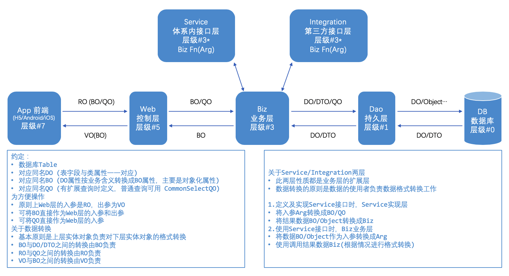
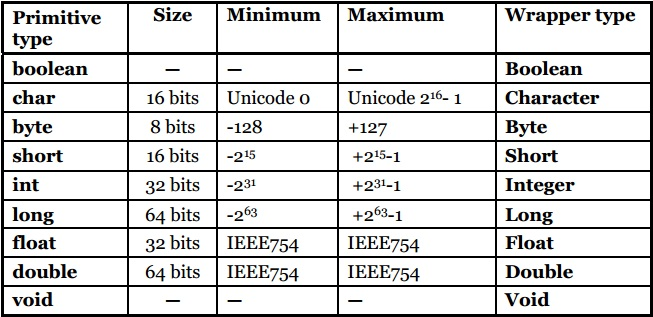

###Java Bean：一种可重用组件，即“一次编写，任何地方执行，任何地方重用”。
满足三个条件：

- 类必须是具体的和公共的
- 具有无参构造器
- 提供一致性设计模式的公共方法将内部域暴露成员属性

主要用途：可以用在 功能、处理、值、数据库访问和JSP中任何可以用Java代码创造的对象。

#Java中 实体类 PO、POJO、DO、Dao、DTO、VO、BO、QO 的概念

####PO(Persistent object)持久对象 [bean, entity 等命名]
在 O/R 映射的时候出现的概念，如果没有 O/R 映射，就没有这个概念存在了。
通常对应数据模型(数据库)，本身具有部分业务逻辑的处理。可以看成是与数据库中的表相映射的 JAVA 对象。
最简单的 PO 就是对应数据库中某个表中的一条记录，多个记录可以用 PO 的集合。PO 中应该不包含任何对数据库的操作。

####POJO(Plain Ordinary Java Object) 简单无规则 JAVA
对象 [一种概念或者接口，身份及作用随环境变化而变化]
纯的传统意义的 JAVA 对象。就是说在一些 Object/Relation Mapping 工具中，能够做到维护数据库表记录的
Persistent Object。
完全是一个符合 Java Bean 规范的纯 Java 对象，没有增加别的属性和方法。我的理解就是最基本的 Java
Bean，只有属性字段及 setter 和 getter 方法！
它不是JavaBean、EntityBean等，不具有任何特殊角色和不继承或不实现任何其它Java框架的类或接口。

- POJO对象有时也被称为Data对象，大量应用于表现现实中的对象。
- 一个 POJO 持久化以后就是 PO
- 直接用它来传递数据，传递过程中就是 DTO
- 直接用来对应表示层就是 VO

####DO(Domain Object)领域对象 [基本等同于 PO]
就是从现实世界中抽象出来的有形或无形的业务实体。一般和数据中的表结构对应。

####Dao(Data access object) 数据访问对象 [类似数据工具集, 而非数据实体类]
是 SUN 的一个标准 j2ee 设计模式，这个模式中有个接口就是 Dao，它负责持久层的操作，为业务层提供接口。
此对象用于访问数据库。通常和 PO 结合使用，Dao 中包含了各种数据库的操作方法。
通过它的方法, 结合 PO 对数据库进行相关的操作。夹在业务逻辑与数据库资源中间。

####DTO(Data Transfer Object)数据传输对象 [经过处理后的PO，可能增加或者减少PO的属性]
这个概念来源于J2EE的设计模式，原来的目的是为了EJB的分布式应用提供粗粒度的数据实体，以减少分布式调用的次数，
从而提高分布式调用的性能和降低网络负载，但现在一般泛指用于展示层与服务层之间的数据传输对象。
数据传输目标往往是数据访问对象从数据库中检索数据。数据传输对象与数据交互对象或数据访问对象之间的差异是一个以不具有任何行为除了存储和检索的数据（访问和存取器）。
简单来说，当我们需要一个对象10个字段的内容，但这个对象总共有20个字段，我们不需要把整个PO对象全部字段传输到客户端，而是可以用DTO重新封装，传递到客户端。
此时，如果这个对象用来对应界面的展现，就叫 VO。

####VO(View Object)值对象 [用于在控制层与视图层之间进行数据传输交换]
视图对象，用于展示层，它的作用是把某个指定页面(或组件)的所有数据封装起来。

####BO(Business Object) 业务对象 [service, manager, business 等命名]
从业务模型的角度看，参见 UML 元件领域模型中的领域对象。封装业务逻辑的 JAVA 对象，通过调用 Dao 方法，结合
PO,VO 进行业务操作。
主要作用是把业务逻辑封装为一个对象，这个对象可以包括一个或多个其它的对象。
形象描述为一个对象的形为和动作，当然也有涉及到其他对象的一些形为和动作。
比如处理一个人的业务逻辑，有睡觉，吃饭，工作，上班等等形为还有可能和别人发生关系的形为。
比如一个简历，有教育经历、工作经历、社会关系等等。 我们可以把教育经历对应一个 PO，工作经历对应一个
PO，社会关系对应一个 PO。
建立一个对应简历的 BO 对象处理简历，每个 BO 包含这些 PO。这样处理业务逻辑时，我们就可以针对 BO 去处理。

####QO(Query object) 查询对象
一般用于组装查询参数。

#OSS逻辑层级以及实体模型设计
####逻辑层级定义

- 前端应用层 (A: App)
- Web控制层 (C: Controller)
- Biz业务层 (B: Manager)
- Dao持久层 (D: Dao)
- DB数据库 (DB: Database)
- Servcie接口层 (S: Service) [类似于生产者producer，对外提供服务，服务于体系内其他业务系统]
- Integration整合层 (I:
  Integrator) [类似于消费者consumer，集成外部服务，主要为了整合非体系内第三方提供的服务]

####数据模型定义
| package | class | description | owner | used in |
|--------:|-------|-------------|:-----:|---------|
| *.common.dal.dataobject | *DO (DatabaseObject)      | 数据库模型对象 | D | DB, D, B |
| *.common.dal.extension | *DTO (DataTransferObject) | 数据库模型扩展对象 | D | DB, D, B |
| *.common.domain | *BO (BusinessObject)      | 业务模型对象 | B | C, B, S, I |
| *.common.query | *QO (QueryObject)         | Biz函数/Dao函数 查询封装对象 | B, D | C, B, D, S, I |
| *.web.request | *RO (RequestObject)       | Web接口入参封装对象 | C | A, C |
| *.web.response | *VO (ViewObject)          | Web接口出参封装对象 | C | A, C |
| *.service.bean | *Biz | 函数出参对象(封装向RPC发送的数据) | S | B, S, 体系内其他微服务系统 |
| *.service.bean | *Arg | 函数入参对象(封装从RPC获取的参数) | S | B, S, 体系内其他微服务系统 |
| *.integration.bean | *Biz | 函数出参对象(封装从RPC获取的数据) | I | B, I, 非体系内的第三方系统 |
| *.integration.bean | *Arg | 函数入参对象(封装向RPC发送的参数) | I | B, I, 非体系内的第三方系统 |

####各层关系说明

#Q&A

- MyBatis的Jar包冲突问题解决方式  
  修改 ${ProjectRoot}/resources/META-INF/spring-devtools.properties 文件里  
  `restart.include.companycommonlibs=com.zenlayer*`

#Swagger2 注解说明

- @Api：用在请求的类上，表示对类的说明
    - tags：说明该类的作用，可以在UI界面上看到的注解
    - value：该参数没什么意义，在UI界面上也看到，所以不需要配置

| 属性名称           | 备注                                     |
|----------------|----------------------------------------|
| value          | url的路径值                                |
| tags           | 如果设置这个值、value的值会被覆盖                    |
| description    | 对api资源的描述                              |
| basePath       | 基本路径                                   |
| position       | 如果配置多个Api 想改变显示的顺序位置                   |
| produces       | 如, “application/json, application/xml” |
| consumes       | 如, “application/json, application/xml” |
| protocols      | 协议类型，如: http, https, ws, wss.          |
| authorizations | 高级特性认证时配置                              |
| hidden         | 配置为true ，将在文档中隐藏                       |

- @ApiOperation：用在请求的方法上，说明方法的用途、作用
    - value：说明方法的用途、作用
    - notes：方法的备注说明

- @ApiImplicitParams：用在请求的方法上，表示一组参数说明
    - @ApiImplicitParam：用在@ApiImplicitParams注解中，指定一个请求参数的各个方面
        - name：参数名
        - value：参数的汉字说明、解释
        - required：参数是否必须传
        - paramType：参数放在哪个地方
            - header --> 请求参数的获取：@RequestHeader
            - query --> 请求参数的获取：@RequestParam
            - path（用于restful接口）--> 请求参数的获取：@PathVariable
            - body（不常用）
            - form（不常用）
        - dataType：参数类型，默认String，其它值dataType="int"
        - defaultValue：参数的默认值
        - allowMultiple=true：表示是数组格式的参数

- @ApiResponses：用在请求的方法上，表示一组响应
    - @ApiResponse：用在@ApiResponses中，一般用于表达一个错误的响应信息
        - code：数字，例如400
        - message：信息，例如"请求参数没填好"
        - response：抛出异常的类

-
@ApiModel：用于响应类上，表示一个返回响应数据的信息（这种一般用在post创建的时候，使用@RequestBody这样的场景，请求参数无法使用@ApiImplicitParam注解进行描述的时候）
    - @ApiModelProperty：用在属性上，描述响应类的属性

#Spring 注解说明
| 注解 | 含义 |
|-----|-----|
| @Component | 最普通的组件，可以被注入到spring容器进行管理 |
| @Repository | 作用于持久层(DAO) |
| @Service | 作用于业务逻辑层(Manager & Service & Integration) |
| @Controller | 作用于表现层(Controller) |

#Java基础数据类型

.